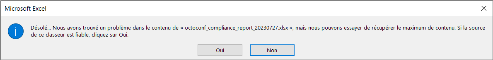
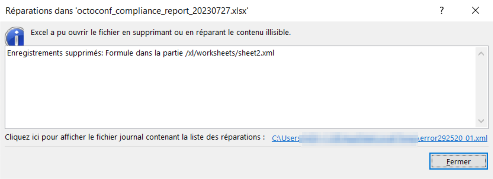

# octoconf

<p align="center">
  
  <br/><br/>
</p>

<p align="center">
  
  
  
  
</p>

Tool dedicated to the realization of configuration audits.

| :information_source: Information |
|:-----------------------------------------------------------|
| This repository is mirrored from a private GitLab instance |

| :warning: Warning |
|:--------------------------------------------------------|
| Read the [disclaimer](#disclaimer) carefully before use |

```text
        ,'""`.       octoconf 2.2.0-beta
       / _  _ \
       |(@)(@)|      Tool for semi-automatic verification
       )  __  (      of security configurations.
      /,'))((`.\
     (( ((  )) ))    /** @nillyr **/
   hh `\ `)(' /'


positional arguments:
  {analyze,baseline,report,config}
                        Available Commands
    analyze             performs an analysis on an archive based on a security baseline
    baseline            performs the interaction with the security baselines
    report              performs the recompilation of the report in PDF format from an adoc file
    config              performs octoconf configuration management

options:
  -h, --help            show this help message and exit
  --version             print version and exit
  --loglevel {DEBUG,INFO,WARNING,ERROR,CRITICAL}
                        set the log level (default: INFO)
```

## Prerequisites

- Python 3.8+;
- pip;
- Asciidoc:
  - [Asciidoctor](https://docs.asciidoctor.org/asciidoctor/latest/install/)
  - [asciidoctor-pdf](https://docs.asciidoctor.org/pdf-converter/latest/install/)
  - [ruby-rouge](https://docs.asciidoctor.org/asciidoctor/latest/syntax-highlighting/rouge/)

## Installation

For regular use, download the latest version from the release page or from [PyPI](https://pypi.org/project/octoconf-cli/) and install it:

```bash
pip install octoconf-*.whl
```

For development purposes, see [CONTRIBUTING](CONTRIBUTING.md).

## Usage

### Baseline

#### List available baselines

The following command allows the user to list available lists:

```bash
octoconf-cli baseline list
```

#### Custom baselines export

The following command allows the user to export custom baselines into a ZIP archive:

```bash
octoconf-cli baseline export
```

| :information_source: Information |
|:------------------------------------------------|
| Only your own custom baselines will be exported |

#### Custom baselines import

The following command allows the user to import an archive (ZIP) with custom baselines:

```bash
# This command:
octoconf-cli baseline import -a [...].zip
# Is the same as this one:
octoconf-cli baseline import -a [...].zip --action merge

octoconf-cli baseline import -a [...].zip --action replace
```

The `merge` action will add the new baselines and update the existing one. The `replace` action will completely delete the existing custom baselines and extract the archive. The default value is `merge`.

#### Baseline translatation

`TODO`

#### Script generation

```bash
# Generate a collection script
octoconf-cli baseline generate_script -p linux -b /path/to/baseline.yml -o /path/to/output_script.sh
# Generate a collection script with utils functions included
octoconf-cli baseline generate_script -p linux -b /path/to/baseline.yml -u /path/to/utils_script.sh -o /path/to/output_script.sh
```

### Analyze and Report

```bash
# Retrieve audit evidence and then analyze
octoconf-cli analyze -b /path/to/baseline.yml -a [...].zip
```

When using [octowriter](https://gitlab.internal.lan/octo-project/octowriter) ([GitHub link](https://github.com/nillyr/octowriter)) submodule, a `.ini` file can be use to init the PDF report.

Create the following file with your own values:

```ini
[DEFAULT]
auditee_name = Tricatel
auditee_contact_full_name = Jacques Tricatel
auditee_contact_email = Jacques.Tricatel@tricatel.fr

project_manager_full_name = Charles Duchemin
project_manager_email = Charles.Duchemin@guide-duchemin.fr

authors_list_full_name = Charles Duchemin; Gérard Duchemin
authors_list_email = Charles.Duchemin@guide-duchemin.fr; Gérard.Duchemin@guide-duchemin.fr

audited_asset = canning-worker1.tricatel.lan

classification_level = Confidential

auditor_company_name = Guide Duchemin
```

Analyze of the results:

```bash
octoconf-cli analyze -b /path/to/baseline.yml -a [...].zip -o "`pwd`/reports/" --ini /path/to/ini_file.ini
```

In order to use a custom theme with your own images, the following command can be used:

```bash
octoconf-cli analyze -b /path/to/baseline.yml -a [...].zip -o "`pwd`/reports/" --ini /path/to/ini_file.ini --template-name template_name --pdf-theme theme_name.yml
```

In order to re-generate the PDF report, the following command can be used:

```bash
octoconf-cli report -i "`pwd`/reports/build/adoc/header.adoc" -o "`pwd`/reports/" --template-name template_name --pdf-theme theme_name.yml
```

| :bulb: Tips |
|:-----------------------------------------------------------|
| If you only have one theme, name the file `default-theme.yml` and you will not have to add this parameter any more |

### Config

```bash
# Print your config
octoconf-cli config print
# Edit settings
octoconf-cli config edit -s <section> -o <option> -v <value>
```

## Troubleshooting

### DeepL

Your API key must be configured. You can do it manually (`$HOME/.config/octoconf/octoconf.ini` & `%localappdata%\octoconf\octoconf.ini`) or with the following command:

```bash
octoconf-cli config edit -s translator -o deepl_api_key -v your_api_key
```

See [Where can I find my Authentication Key?](https://support.deepl.com/hc/en-us/articles/360020695820-Authentication-Key).

### Microsoft Excel

If you got the following errors when opening the `*.xlsx` file, you need either to use `*-ms-excel-compatible.xlsx` file or use this [conversion script](https://gitlab.internal.lan/octo-project/octokonverter/-/blob/main/scripts/octoconf_xlsx_to_ms_excel.py) ([GitHub link](https://github.com/nillyr/octokonverter/blob/main/scripts/octoconf_xlsx_to_ms_excel.py)).




## Disclaimer

- This is not a turn key tool, read the documentation for more information;
- This tool does not offer any guarantee;
- The authors of this tool cannot be held responsible for the effects caused by the executed commands;
- It is highly recommended to risk assess your commands in a test environment before using them in production;
- It is highly recommended that the risk of service degradation be graded before any use on a system in production.

## CONTRIBUTING

See [CONTRIBUTING](CONTRIBUTING.md).

## Maintainer

- Nicolas GRELLETY

## Authors

- Nicolas GRELLETY

## Copyright and license

Copyright (c) 2021 Nicolas GRELLETY

This software is licensed under GNU GPLv3 license. See `LICENSE` file in the root folder of the project.

The information used in the configuration file comes from the movie "[L'Aile ou la Cuisse](https://www.allocine.fr/film/fichefilm_gen_cfilm=47573.html)".

Icons made by [Freepik](https://www.flaticon.com/authors/freepik "Freepik") from [www.flaticon.com](https://www.flaticon.com/ "Flaticon")
